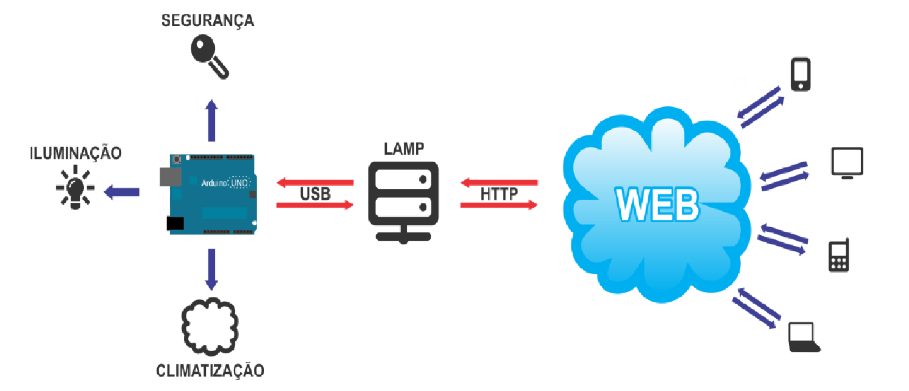

# [SARA](http://github.com/omadson/sara)
Sistema de Automação Residencial com a utilização da plataforma Arduíno.

Nesse trabalho é apresentado um sistema de baixo custo que pode ser empregado em automação residencial, visando facilitar o dia a dia de pessoas comuns ou com necessidades especiais, solucionando problemas frequentes e aparentemente comuns. O usuário utiliza uma aplicação web como interface de controle, um servidor web como centralizador de processamento e sensores e atuadores como controladores de dispositivos. O usuário poderá acessar o sistema através de uma rede local, ou em qualquer lugar do mundo, pela Internet. O propósito deste projeto é controlar os eletroeletrônicos de um ambiente residencial através de um sistema totalmente informatizado, usando para isto diversas ferramentas open source, a fim de que o sistema possa estar em contínuo estado de evolução.

## Componentes

* Página de login
* Painel geral
* Página de subsistemas

## Tecnologias
### Linguagens
* HTML5
* CSS3
* JavaScript
* PHP
* MySQL
* Python (Somente para criar uma porta serial virtual)

### Frameworks
* JQuery Mobile

## Licença

Código fonte disponível em: [github](https://github.com/omadson/sara), licenciado como [MIT](http://opensource.org/licenses/mit-license.php).

Desenvolvido por [Madson Dias](http://omadson.wordpress.com)
